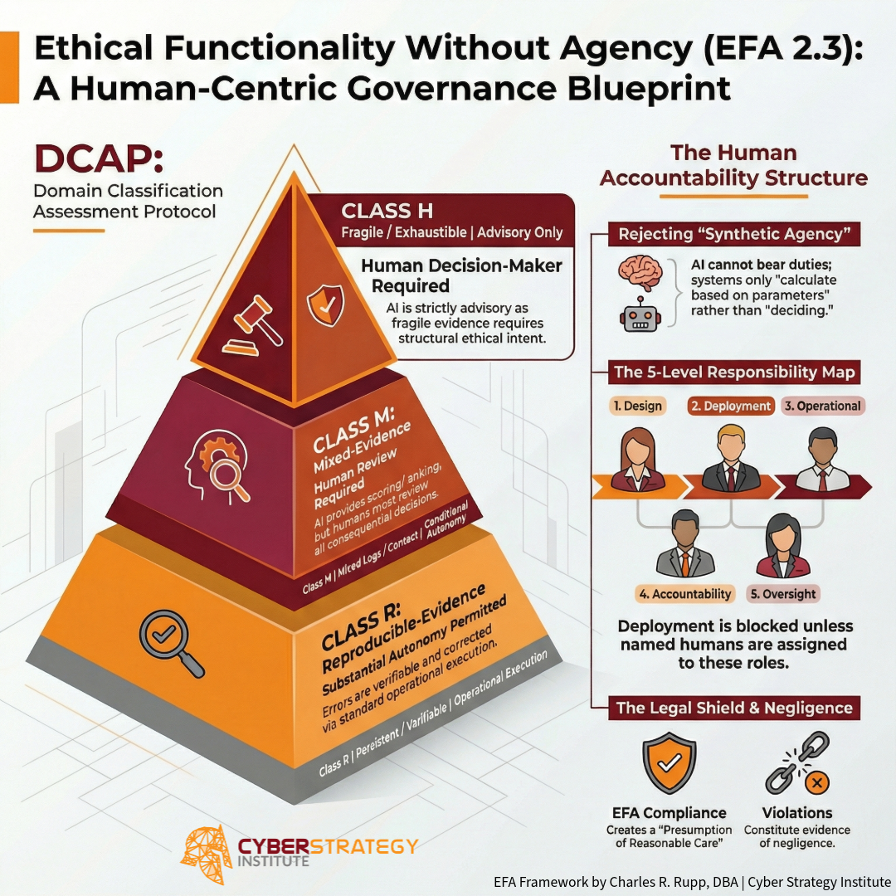
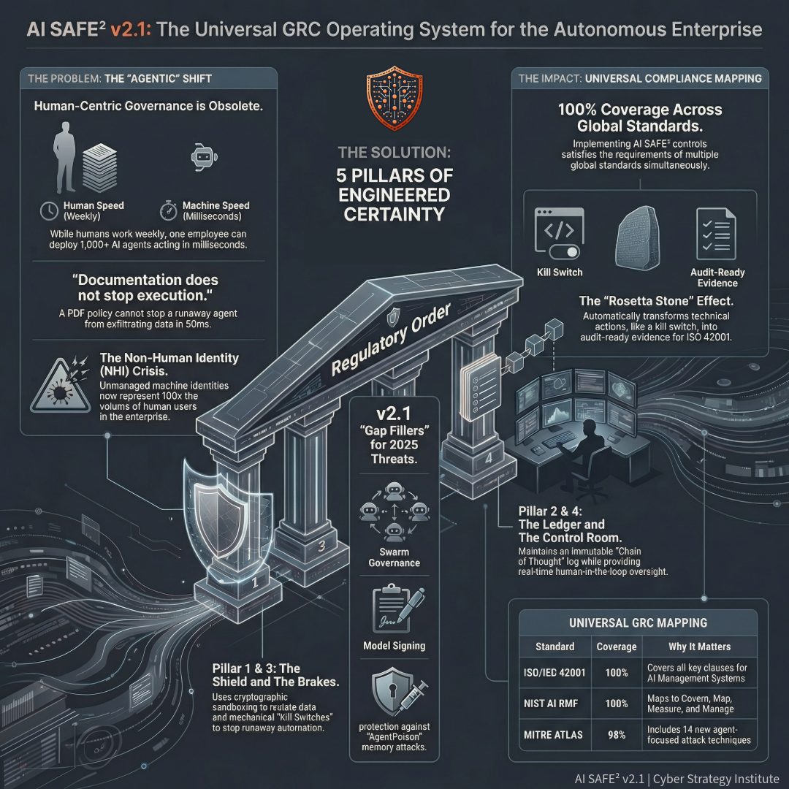
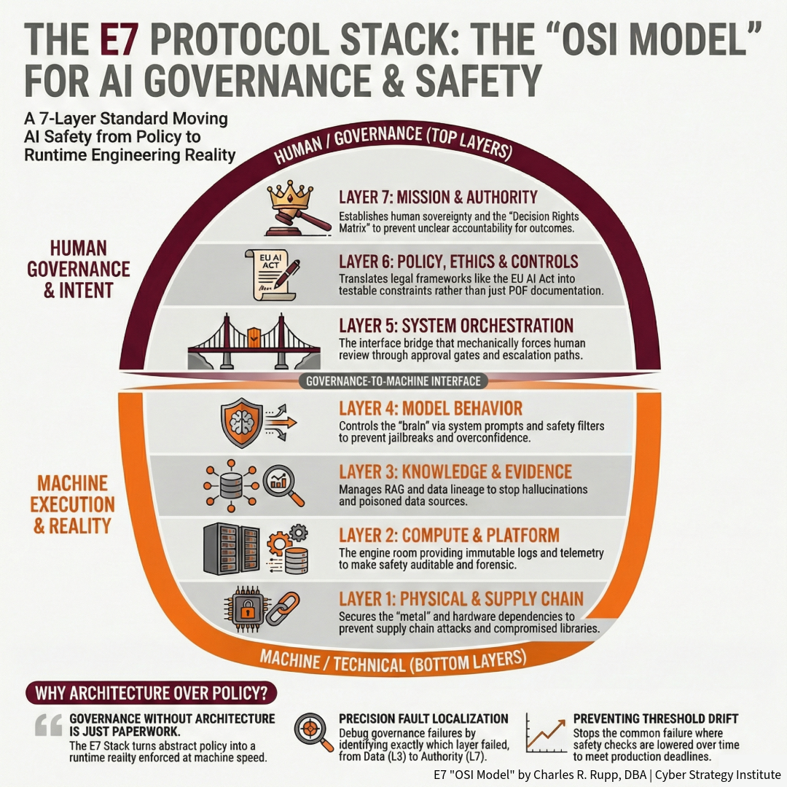

# Research Note: The 7-Layer Reference Architecture
### Integrating Ethical Governance (EFA) with Runtime Enforcement (AI SAFE²)

**ID:** RN-2026-012 | **Focus:** Architecture & Strategy | **Status:** Verified

## 1. Executive Summary: The Engineered Certainty Stack
The current AI landscape faces a **"Compliance-Security Paradox"**: organizations are compliant with regulations via documentation but remain structurally vulnerable to machine-speed attacks and agentic errors.

The solution lies in a unified architecture that layers **Ethical Functionality Without Agency (EFA)** as the strategic governance mandate, **AI SAFE²** as the operational enforcement toolkit, and the **E7 Protocol Stack (OSI Model)** as the structural logic that binds them together.

---

### 📊 Visualizing the Architecture

  

---

## 2. Component Summaries

### A. EFA (Ethical Functionality Without Agency)
**The "Why" (Strategic Layer):**
EFA is a governance framework that categorically rejects **"synthetic agency,"** asserting that AI cannot be a moral agent; liability must always anchor to a human principal.

**Core Mechanism: The Domain Classification Assessment Protocol (DCAP)**
*   **Class R (Reproducible):** Low stakes, autonomy permitted.
*   **Class M (Mixed):** Human review required.
*   **Class H (High-Attrition/High-Stakes):** AI is strictly advisory; human decision-making is mandatory.

  

### B. AI SAFE² (Secure AI Framework for Enterprise Ecosystems)
**The "How" (Runtime Layer):**
AI SAFE² is the engineering toolkit designed to enforce governance at machine speed. It addresses the **"Latency Gap"** where policy cycles are weekly but execution cycles are millisecond-based.

**The 5 Pillars of Enforcement:**
1.  **[Sanitize & Isolate](../taxonomy/01_sanitize_isolate.md) (The Shield):** Input validation and cryptographic sandboxing.
2.  **[Audit & Inventory](../taxonomy/02_audit_inventory.md) (The Ledger):** Immutable logging and SHA-256 state verification.
3.  **[Fail-Safe & Recovery](../taxonomy/03_failsafe_recovery.md) (The Brakes):** Kill switches and circuit breakers.
4.  **[Engage & Monitor](../taxonomy/04_engage_monitor.md) (The Control Room):** HITL workflows and behavioral anomaly detection.
5.  **[Evolve & Educate](../taxonomy/05_evolve_educate.md) (The Feedback Loop):** Red teaming and threat intelligence.

  

### C. The E7 Stack (The OSI Model for AI)
**The "Architecture" (Structural Layer):**
Inspired by the OSI networking model, the E7 Stack decomposes AI systems to isolate faults and standardize interfaces between "Mission" (Human) and "Compute" (Machine).

*   **Layers 1-2 (Infrastructure):** Physical Supply Chain & Compute.
*   **Layers 3-5 (Operational):** Knowledge/Evidence, Model Behavior, System Orchestration.
*   **Layer 6 (Controls):** Policy & Ethics (Normative Guardrails).
*   **Layer 7 (Authority):** Mission & Human Sovereignty.

  

---

## 3. The Synergy: Why We Need All Three
We need this triad because *"Governance without a toolkit lacks direction, and a toolkit without governance lacks meaning."*

1.  **Preventing "Agency Leakage" (EFA + E7):** Without the explicit **Layer 7: Mission and Authority**, organizations risk decision rights silently drifting from humans to machines.
2.  **Enforcing "Policy-as-Code" (AI SAFE² + EFA):** EFA defines the rule (e.g., "Class H requires Human Authorship"). AI SAFE² provides the mechanical "interruption rights" to enforce it via **[P4.T7.1]**.
3.  **Solving the "Responsibility Gap" (E7 Stack):** By breaking the system into 7 layers, we can trace liability. If a failure occurs, was it a **Layer 3 (Data Provenance)** issue or a **Layer 7 (Authority delegation)** issue?

---

## 4. The E7 Stack: The OSI Model for AI

| Layer | Traditional OSI (IT) | E7 Stack (AI Governance) | Role in the Stack |
| :--- | :--- | :--- | :--- |
| **7** | Application | **Mission & Authority** | **GOVERNANCE (EFA)** Human Sovereignty. Defines who owns the decision. |
| **6** | Presentation | **Policy & Ethics** | **GOVERNANCE (EFA)** Translates laws/ethics into testable constraints. |
| **5** | Session | **System Orchestration** | **AI SAFE² (Orchestration)** Workflow design, tool calls, and approval gates. |
| **4** | Transport | **Model Behavior** | **AI SAFE² (Runtime)** Refusal policies, safety filters, structured outputs. |
| **3** | Network | **Knowledge & Evidence** | **AI SAFE² (Data)** RAG retrieval, data provenance, vector DBs. |
| **2** | Data Link | **Compute & Platform** | **AI SAFE² (Infra)** Inference serving, logging telemetry, access control. |
| **1** | Physical | **Physical & Supply Chain** | **AI SAFE² (Supply Chain)** GPUs, model signing, vendor dependencies. |

---

## 5. Comparative Analysis: NIST AI RMF vs. The Stack

While NIST AI RMF is the standard for *mapping* risk, it was built for predictive models, not autonomous agents.

| Weakness | The NIST Gap | The AI SAFE² Solution |
| :--- | :--- | :--- |
| **Engineering Controls** | Provides high-level guidance ("Manage Risk") but no code. | Provides **Policy-as-Code**. Translates intent into JSON schemas and **Kill Switches [P3.T5.7]**. |
| **Agentic Blindness** | Ignores Swarm Intelligence and Agent-to-Agent loops. | Adds **9 dedicated sub-domains** for Swarm & Distributed Controls (Gap Filler #1). |
| **Identity Crisis** | Treats identity as a human problem. Misses **NHI**. | Treats **Non-Human Identities** as "First-Class Citizens" with credential rotation and least privilege. |
| **Latency Gap** | Assumes weekly/monthly governance cycles. | Enforces rules at **Machine Speed**. Blocks exfiltration in milliseconds. |
| **Liability Trap** | Leaves "Synthetic Agency" ambiguous. | **EFA (Layer 7)** categorically rejects synthetic agency, establishing a clear **Moral Chain of Custody**. |

---

## 6. Strategic Opportunities

### 🏛️ The "Universal GRC" Rosetta Stone
By implementing AI SAFE² v2.1, an organization automatically satisfies requirements across multiple global standards.
*   **100% Coverage:** ISO/IEC 42001, NIST AI RMF, OWASP Top 10.
*   **98% Coverage:** MITRE ATLAS.

### 🆔 Governance for the "Invisible Workforce"
Traditional GRC misses the explosion of **Non-Human Identities (NHIs)**. This stack provides dedicated governance for the identity lifecycle of AI agents, preventing "credential sprawl."

### 🧠 Defense Against Cognitive Attacks
While legacy tools scan for simple prompt injections, AI SAFE² targets **AgentPoison** and **MINJA**. It secures **Layer 3 (Knowledge)** by implementing cryptographic memory fingerprinting **[P1.T1.5]**.

---

## 🎯 Conclusion: The "So What"
The era of *"move fast and break things"* is over. In the Agentic AI era, *"if you break things, you break the company."*

*   **NIST AI RMF** = The Architecture Blueprint.
*   **EFA** = The Moral Mandate.
*   **AI SAFE²** = The Construction Crew & Security System.

By adopting this stack, you transition from **Forensics** (figuring out why the agent failed) to **Engineered Certainty** (preventing the agent from failing).

> **The Bottom Line:** You cannot govern what you cannot control. This stack gives you the controls, the console, and the code to lead the autonomous future.

---
*Powered by [Cyber Strategy Institute](https://cyberstrategyinstitute.com/AI-Safe2/)*
